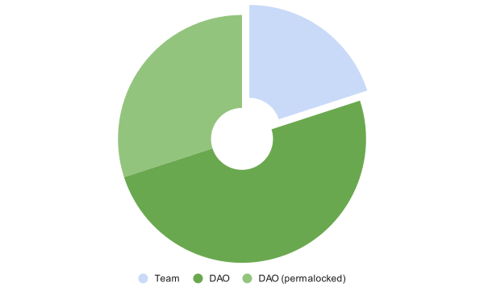

# Allocation

<figure><figcaption>
Initial Allocation: Team 20%, DAO 80%.
</figcaption></figure>

The community will become responsible for the spending of the DAO's QUARTZ upon deployment of Snapshot and then, the DAO. Our recommendation for the allocation no longer contains hard values. Instead, we list relevant areas for efficient DAO spending:

* **Insurance**

QUARTZ might be used to capitalize an insurance fund. Once in place, Quartz stakers will benefit from the coverage.

* **Liquidity Mining/Bonds**

QUARTZ can be distributed to incentivize additional liquidity (e.g. through KPI options).

* **TVL Mining**

QUARTZ can be distributed to increase the TVL of Sandclock's metavaults (e.g. through KPI options).

* **Ecosystem Development/Grants**

QUARTZ can be granted to incentivize development or marketing of our growing ecosystem.


Team tokens are being vested linearly over three years. If at any point during our temperature checks, the community wishes for complete decentralization, we will gradually distribute our share of the tokens through OTC deals, dutch auctions, and other such mechanisms, in order to minimize negative price action. Initially, for the success of the project, the team will retain a significant portion of the tokens, outlined above. That being said we will generally refrain from voting on proposals with an excessive amount of tokens unless to veto outright malicious actions.


### Charity Mining: Permalocked Tokens

At least 30% of QUARTZ shall remain locked in perpetuity. The purpose of this QUARTZ is to incentivize Giving or other actions on-chain without diluting existing holders. **It achieves this through a delegative function,** whereby a trusted backend can delegate voting power to an address on Polygon without transferring ownership of the tokens.

It was initially designed in order to incentivize giving, but it can fulfill other objectives while preserving the value of QUARTZ.

## Chronological Records

3,235,547 were sold during Phase I

500,000 were sold to a limited number of strategic partners (partnership incentive alignment and additional development services, 50% still being vested until October 23 2023)

1,371,376 were sold during Phase II

116,279 were loaned to Lindy Labs for liquidity provision on SushiSwap (matched with 2,000,000 USDC)

29,412 were loaned to Wintermute for liquidity provision on SushiSwap (matched with 500,000 USDC)

56,088 were used for Liquidity Mining on SushiSwap

168,500 were used for Liquidity Mining on Olympus

470,583 were loaned to Wintermute for market making on KuCoin

20,000 were given to KuCoin (plus an undisclosed amount of USDC) for listing purposes

22,000 were given to KuCoin for their marketing campaign

23,673 have been used for grants
