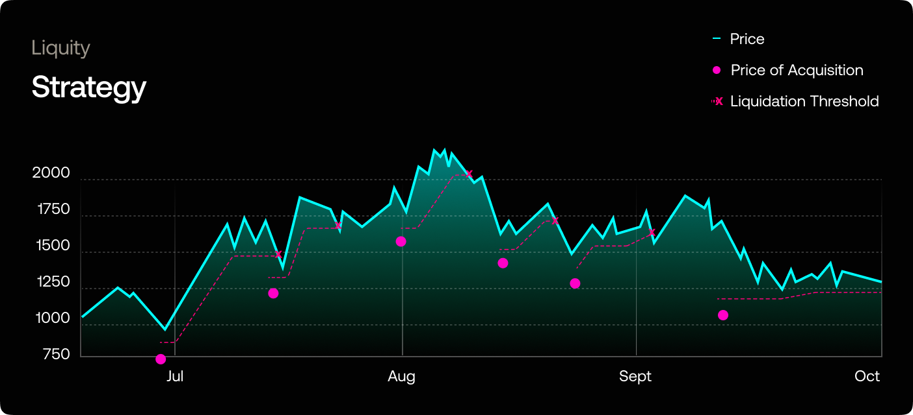

# Liquity

## Overview

Liquity is a credit protocol. Users deposit collateral and can open a credit line denominated in LUSD.

LUSD can be deposited to the Stability Pool to protect Liquity against insolvency. LUSD in this contract is used to pay off debt, in exchange for discounted collateral and other rewards.


The Metavault **receives LQTY at a fixed APR of 8%** and **earns additional dynamic returns on its stablecoin deposits by dollar-cost averaging into liquidated ETH** through Liquity Protocol's Stability Pool and swapping for the underlying. Liquidation profits are then reinvested into the strategy, compounding yield for depositors over time.

Because of this, the short term APY could be as low as 6% and as high as 1000%. It is completely unpredictable. As a result, for our frontend, we use a range using the 7d and the 365d average rolling APR.


<figure><figcaption></figcaption></figure>

During bear markets and bull/crab market high volatility periods, the frequency of liquidations increases, and so does the Stability Pool's revenue. Because of this **we recommend a minimum deposit duration of 1 month.**

For more information, [visit Liquity's Docs.](https://docs.liquity.org/)

### Risk

Other than the ever present smart contract risk, loss is incurred when the average value of the asset acquired at the time of compounding is lower than its market value. Due to the deep liquidity of all assets involved, as well as the lower price of acquisition of these assets, we expect such events to be extremely unlikely, but not impossible to transpire.

&#x20;Sandclock makes no promises regarding the yield generated.

## Methods

The Metavault earns a return on its stablecoin deposits by dollar-cost averaging into liquidated ETH through Liquity Protocol's stability pool and swapping for the underlying. Liquidation profits are then reinvested into the strategy, compounding yield for depositors over time.

1. Deposit LUSD to Liquity’s stability pool;
2. Stability pool contract sends LQTY and LUSD, as well as ETH rewards from liquidations;
3. Backend uses heuristics to know when to liquidate on 0x for LUSD using Flashbots to avoid getting frontrun;
4. Go to 1.

### Claim Heuristics

ETH, LUSD, and LQTY yield is received whenever an interaction with the contract takes place.

Typically, we only claim when we want to liquidate, based on the trailing stop loss heuristic. However, if it has been too long and we want fresher data on the principal for Sandclock's dashboard we use a heartbeat heuristic. We expect the heartbeat heuristic to be used infrequently, as all rewards accrue to the strategy contract with each interaction.

All actions occur automatically.

#### **Trailing Stop Loss**

The backend checks for liquidations on the stability pool every 10 minutes, logging each event. When a liquidation takes place it logs the amount of ETH liquidated that we are entitled to, the price of acquisition, and our balance. The backend uses this data and ETH’s current price to calculate our weighted average price of acquisition, and puts a trailing stop loss order in place, which in turns sets the ETH liquidation price for the backend. The backend checks ETH’s price every 10 minutes and compares it to the liquidation price. If it is equal or lower than the liquidation price, it exchanges ETH and LQTY for LUSD and compounds.

#### Heartbeat

If it has been 4 weeks since the last claim, claim and liquidate for the sake of yield distribution to Sandclock users, as well as compounding.
